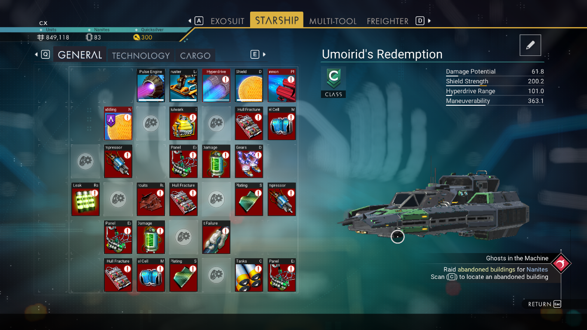
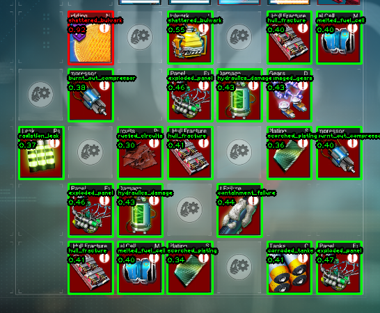

# no-mans-sky-ship-repair-item-list-generator

Automatically produce a list of items you need to gather to repair your broken space ship in No Man's Sky with computer vision.

## Description

Are you tired of spending time deciding whether or not you should repair a space ship you found, or just sell it as scrap? Me too.

This tool will automatically scan a screenshot of the inventory view, detect slots which need to be repaired, and spit out a list of raw materials that the repair will require.

Uses OpenCV to detect the inventory items, and uses basic histogram feature matching to match the detected inventory items with the known possible items in the `images/` directory.

### Example

Using the following screeshot as input:

> 

The tool will produce this image:

> 

and this output:

```
{'exploded_panel': 3, 'corroded_tanks': 1, 'scorched_plating': 2, 'melted_fuel_cell': 2, 'hull_fracture': 3, 'containment_failure': 1, 'hydraulics_damage': 2, 'burnt_out_compressor': 2, 'rusted_circuits': 1, 'radiation_leak': 1, 'damaged_gears': 1, 'shattered_bulwark': 1}

                    Amount
Material
activated_copper        75
antimatter               4
chlorine                10
chromatic_metal        660
dioxite                 80
gold                   270
magnetised_ferrite     150
metal_plating            6
oxygen                 100
paraffinium            150
phosphorus             150
platinum               100
pugneum                 60
pure_ferrite           375
pyrite                 120
wiring_loom              7
```

Inventory items which the tool thinks it has correctly recognized are shown in green, as well as the item's name in green. The number below is the tool's confidence level (from 0 to 1 with 0 being the best and values over 0.7 being terrible).

## Running

Requires Python 3. If you're familiar with running python projects, install requirements.txt and change `IMG_A` in `index.py` to point at your screenshot.

0. Download this repository
1. Install Python 3
  - You may already have it installed. In a terminal window, type `python3 --version` or `python --version` or `py --version`
2. Install required libraries
  - `pip install -r requirements.txt` or `python3 -m pip install -r requirements.txt`
3. Copy your screenshot into some directory nearby
4. Edit `index.py` and change the `IMG_A` path to point at that screenshot
5. Run it with `python3 index.py`
6. List of materials gets dumped into your terminal. You'll see a window popup with the detection image. If it's borked, open an issue and attach a screenshot of what it looks like, and the original image.

## How does it work?
// todo, probably make a jupyter notebook or something
